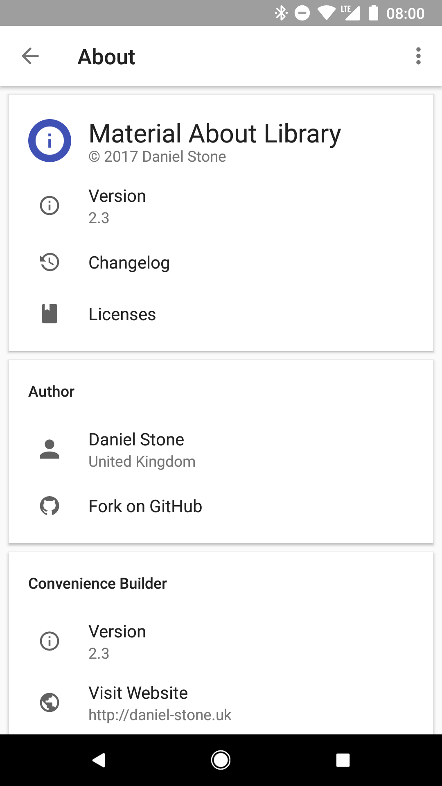
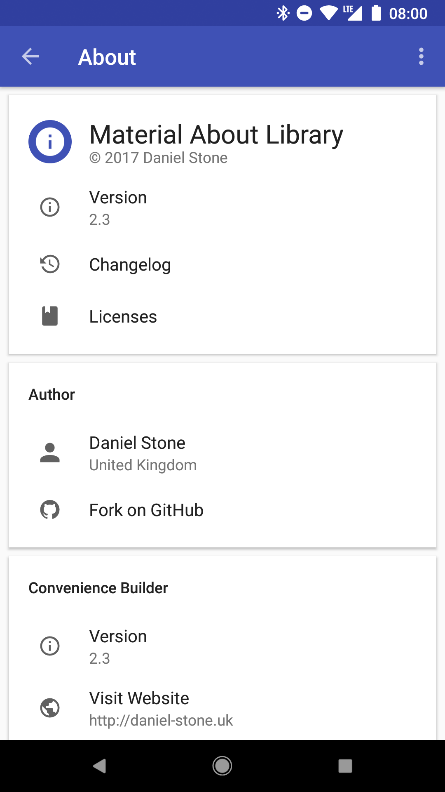
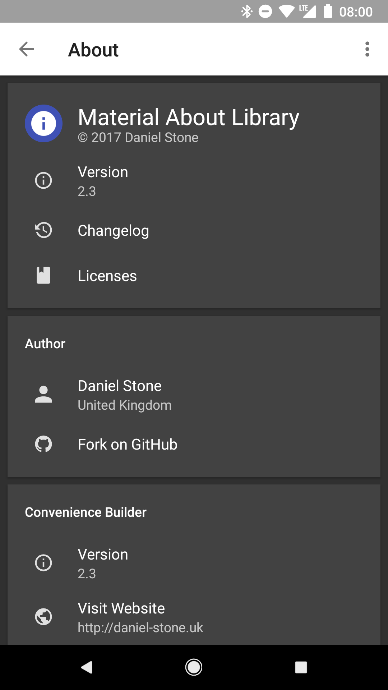
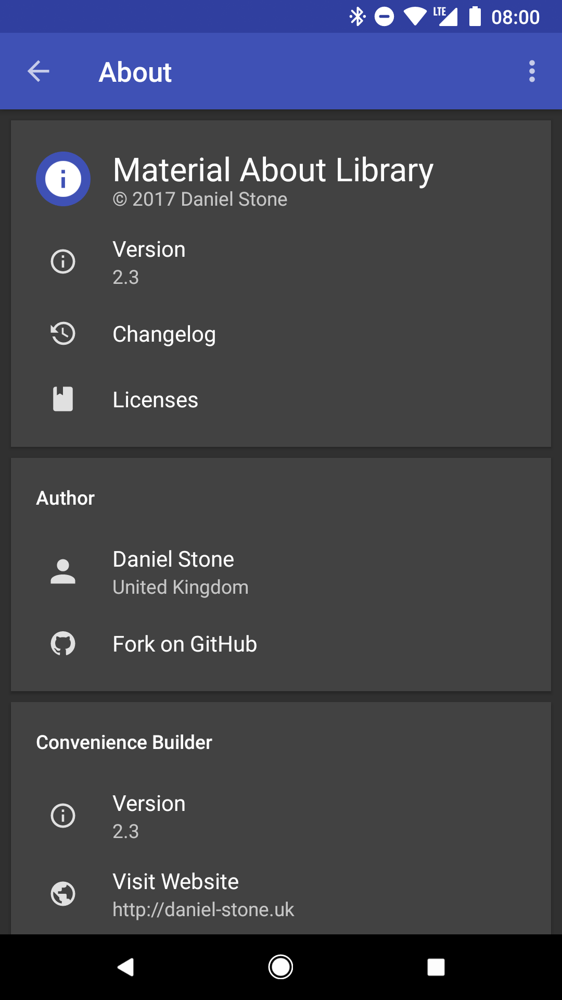
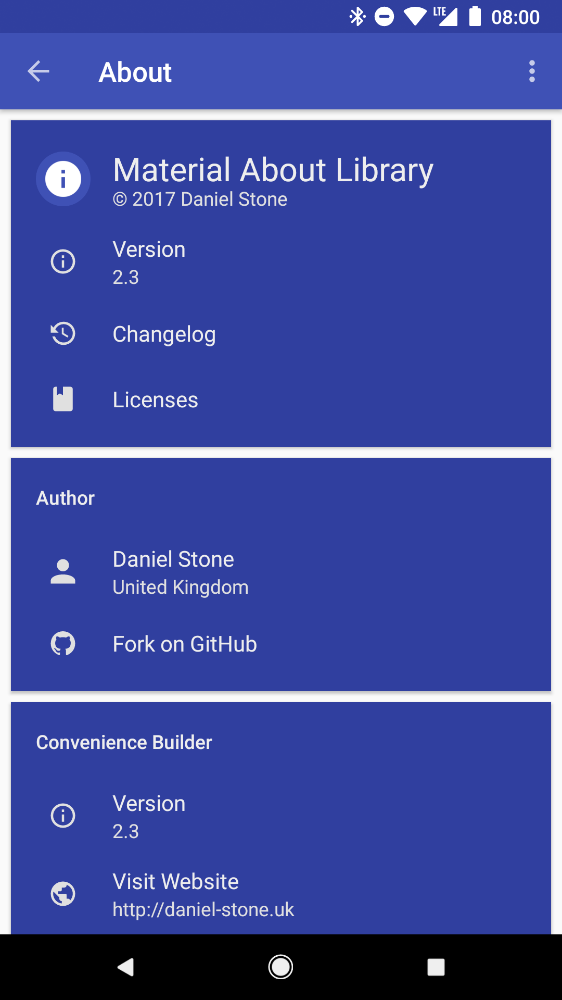
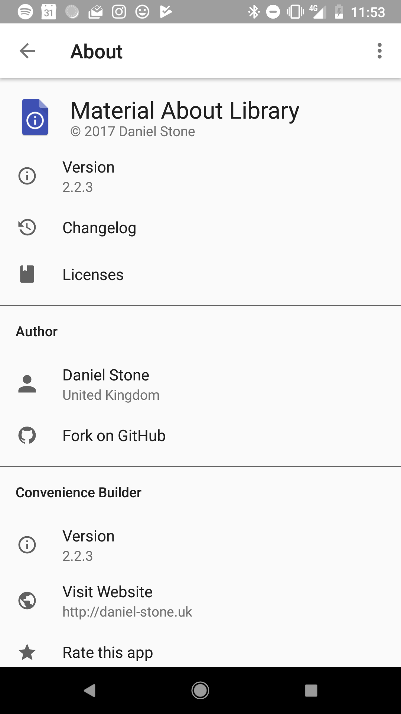

# material-about-library

[![Release][101]][102]  [](https://raw.githubusercontent.com/daniel-stoneuk/material-about-library/master/LICENSE) [](https://github.com/daniel-stoneuk/material-about-library/issues)

Makes it easy to create a beautiful about screen for your app. Generates an `Activity` or `Fragment`.

Idea from here: [Heinrich Reimer's open-source-library-request-manager][6]

Design inspired by Phonograph.

If you use this library in your app, please let me know and I'll add it to the list.

## Demo

<a href='https://play.google.com/store/apps/details?id=com.danielstone.materialaboutlibrarydemo&pcampaignid=MKT-Other-global-all-co-prtnr-py-PartBadge-Mar2515-1'></a>

## Screenshots

| Light with Light Action Bar    | Light with Dark Action Bar     | Dark with Light Action Bar    | Dark with Dark Action Bar     | Custom Cardview Background     | Custom card & action item layout |
| ------------------------------ | ------------------------------ | ------------------------------ | ------------------------------ | ------------------------------ |  ------------------------------ |
|  |  |  |  |  |  |

## Features

- Material design
- Modular backend
- Easy to implement
- Simple but intuitive API
- Dynamic item support

## Dependency

_material-about-library_ is available on [**jitpack.io**][1] and has support for different support library versions. See the full list [here](https://jitpack.io/#daniel-stoneuk/material-about-library).

**Gradle dependency:**

```gradle
allprojects {
    repositories {
        maven { url 'https://jitpack.io' }
    }
}
```

```gradle
dependencies {
    compile 'com.github.daniel-stoneuk:material-about-library:2.4.1'
}
```

Releases from 2.4.1 onwards will be using the AndroidX libraries. Use an older release if you wish to continue using the support library version.

## Migration

View the migration guide [here](/MIGRATION.md)

## Setup

### Activity

Your `Activity` must extend [`MaterialAboutActivity`][materialaboutactivityjava] and be in your _AndroidManifest.xml_:

```java
public class ExampleMaterialAboutActivity extends MaterialAboutActivity {

    @Override
    @NonNull
    protected MaterialAboutList getMaterialAboutList(@NonNull Context context) {
        return new MaterialAboutList.Builder()
                .build(); // This creates an empty screen, add cards with .addCard()
    }

    @Override
    protected CharSequence getActivityTitle() {
        return getString(R.string.mal_title_about);
    }
    
}
```

Ensure that the theme extends either of these themes, and apply primary & accent colours:

- `Theme.Mal.Light` (light theme with light toolbar)
- `Theme.Mal.Light.DarkActionBar` (light theme with dark toolbar)
- `Theme.Mal.Dark` (dark theme with dark toolbar)
- `Theme.Mal.Dark.LightActionBar` (dark theme with light toolbar)

```xml
<manifest ...>
    <application ...>
        <activity android:name=".ExampleMaterialAboutActivity"
            android:theme="@style/AppTheme.MaterialAboutActivity"/>
    </application>
</manifest>
```

```xml
<style name="AppTheme.MaterialAboutActivity" parent="Theme.Mal.Light">
    <item name="colorPrimary">@color/colorPrimary</item>
    <item name="colorPrimaryDark">@color/colorPrimaryDark</item>
    <item name="colorAccent">@color/colorAccent</item>
</style>
```

### Fragment

Your `Fragment` must extend [`MaterialAboutFragment`][materialaboutfragmentjava].

```java
public class ExampleMaterialAboutFragment extends MaterialAboutFragment {

    @Override
    protected MaterialAboutList getMaterialAboutList(final Context activityContext) {
        return new MaterialAboutList.Builder()
                .build(); // This creates an empty screen, add cards with .addCard()
    }
    
    @Override
    protected int getTheme() {
        return R.style.AppTheme_MaterialAboutActivity_Fragment;
    }
    
}
```

Pass in a theme that extends one of the styles above

```xml
<style name="AppTheme.MaterialAboutActivity.Fragment" parent="Theme.Mal.Light">
    <item name="colorPrimary">@color/colorPrimary</item>
    <item name="colorPrimaryDark">@color/colorPrimaryDark</item>
    <item name="colorAccent">@color/colorAccent</item>
</style>
```

### Add Cards:

Start building a "card" using [`MaterialAboutCard.Builder()`][8]

```java
public class ExampleMaterialAboutActivity extends MaterialAboutActivity {

    @Override
    @NonNull
    protected MaterialAboutList getMaterialAboutList(@NonNull Context context) {
        MaterialAboutCard card = new MaterialAboutCard.Builder()
                // Configure card here
                .build();

        return new MaterialAboutList.Builder()
                    .addCard(card)
                    .build();
    }
}
```

Give the card a title by calling `.title()` on the `MaterialAboutCard.Builder`

```java
MaterialAboutCard card = new MaterialAboutCard.Builder()
    .title("Author")
    .build();
```

### Add Items to a card:

There are currently two types of items you can add to a card - [`MaterialAboutTitleItem`][9] and [`MaterialAboutActionItem`][10]. Other types of items are planned, for example "person" items which feature buttons to showcase a single person. Feel free to submit a PR or Issue for more item ideas.

- `MaterialAboutActionItem`: Standard item with text, icon and optional subtext.
- `MaterialAboutTitleItem`: Larger item with large icon (e.g. app icon) and larger text.

[`MaterialAboutTitleItem`][9] is created with [`MaterialAboutTitleItem.Builder()`][9] and lets you specify **text** and an **icon**.

```java
MaterialAboutCard.Builder cardBuilder = new MaterialAboutCard.Builder();
cardBuilder.addItem(new MaterialAboutTitleItem.Builder()
        .text("Material About Library")
        .icon(R.mipmap.ic_launcher)
        .build());
```

[`MaterialAboutActionItem`][10] is created with [`MaterialAboutActionItem.Builder()`][10] and lets you specify **text**, **sub-text**, an **icon** and an **OnClickAction**.

```java
cardBuilder.addItem(new MaterialAboutActionItem.Builder()
        .text("Version")
        .subText("1.0.0")
        .icon(R.drawable.ic_about_info)
        .setOnClickAction(new MaterialAboutActionItem.OnClickAction() {
            @Override
            public void onClick() {
                Toast.makeText(ExampleMaterialAboutActivity.this, "Version Tapped", Toast.LENGTH_SHORT)
                        .show();
            }
        })
        .build());
```

### Return the list:

Create a [`MaterialAboutList`][11] using [`MaterialAboutList.Builder()`][11], passing in the cards you would like to display.

```java
MaterialAboutCard card = new MaterialAboutCard.Builder()
        .title("Hey! I'm a card")
        .build();

return new MaterialAboutList.Builder()
        .addCard(card)
        .build();
```

Check out a working example in [`Demo.java`][3].

**Tip:** You can either use _Strings_ / _Drawables_ or _Resources_ when creating `MaterialAboutItem`'s

**Tip:** Use [Android-Iconics][iconics] for icons. "Android-Iconics - Use any icon font, or vector (.svg) as drawable in your application."

**Tip:** Use [ConvenienceBuilder][conveniencebuilderjava] to easily create items or OnClickActions.

**Tip:** Customise text colour and card colour in your styles. Example below: 

```xml
<style name="AppTheme.MaterialAboutActivity.Light.CustomCardView" parent="Theme.Mal.Light">
    <!-- Customize your theme here. -->
    <item name="colorPrimary">@color/colorPrimary</item>
    <item name="colorPrimaryDark">@color/colorPrimaryDark</item>
    <item name="colorAccent">@color/colorAccent</item>
    <item name="mal_card_background">@color/colorPrimaryDark</item>
    <item name="android:textColorPrimary">#eee</item>
    <item name="android:textColorSecondary">#ffe0e0e0</item>
    <item name="mal_color_primary">#eee</item>
    <item name="mal_color_secondary">#ffe0e0e0</item>
    <!-- You can specify custom theme for toolbar and toolbarPopup. -->
    <item name="mal_toolbarTheme">@style/Theme.Mal.Toolbar.Dark</item>
    <item name="mal_toolbarPopupTheme">@style/Theme.Mal.Toolbar.Dark</item>
</style>
```

### Custom Adapters:
It is possible to replace the contents of a card with a custom adapter. If you do this, then none of the items associated with the card will be displayed. Check out the demo app, in which use [LicenseAdapter](https://github.com/yshrsmz/LicenseAdapter) (hence the INTERNET permission).

```java
MaterialAboutCard.Builder customAdapterCardBuilder = new MaterialAboutCard.Builder();
// Create list of libraries
List<Library> libraries = new ArrayList<>();

// Add libraries that are hosted on GitHub with an Apache v2 license.
libraries.add(Licenses.fromGitHubApacheV2("yshrsmz/LicenseAdapter"));
libraries.add(Licenses.fromGitHubApacheV2("daniel-stoneuk/material-about-library"));

customAdapterCardBuilder.title("Custom Adapter (License Adapter)");
customAdapterCardBuilder.customAdapter(new LicenseAdapter(libraries));
});
```


### Dynamic items:
It's possible to create dynamic items that either change on tap (or when any other event occurs). There are two examples in the sample application. Simply change the items in the list variable and then call `refreshMaterialAboutList()`. DiffUtil calculates the changes to animate in the RecyclerView.

```java
final MaterialAboutActionItem item = new MaterialAboutActionItem.Builder()
            .text("Dynamic UI")
            .subText(subText)
            .icon(new IconicsDrawable(c)
                    .icon(CommunityMaterial.Icon.cmd_refresh)
                    .color(ContextCompat.getColor(c, R.color.mal_color_icon_dark_theme)
                    ).sizeDp(18))
            .build();
    item.setOnClickAction(new MaterialAboutItemOnClickAction() {
        @Override
        public void onClick() {
            item.setSubText("Random number: " + ((int) (Math.random() * 10)));
            refreshMaterialAboutList();
        }
    });
```

### Custom card and Action layout
To get a layout that is similar to the 6th screenshot above simply override the files `mal_material_about_action_item` and `mal_material_about_list_card` by creating new layout resources with the same filename. See [here](https://github.com/daniel-stoneuk/material-about-library/tree/master/app/src/main/res/layout).

## Contributors

- Daniel Stone ([@daniel-stoneuk](https://github.com/daniel-stoneuk))
- Robert Pösel ([@Robyer](https://github.com/Robyer))
- Jonas Uekötter ([@ueman](https://github.com/ueman))
- Rainer Lang ([@Rainer-Lang](https://github.com/rainer-lang))
- Sebastian Guillen ([@code-schreiber](https://github.com/code-schreiber))
- and [others](https://github.com/daniel-stoneuk/material-about-library/graphs/contributors)

## Apps using this library

- [Monitor for EnergyHive & Engage][5]
- [Crafting Assistant NMS](https://play.google.com/store/apps/details?id=biemann.android.craftingnms)
- [ComicsDB Client](https://play.google.com/store/apps/details?id=cz.kutner.comicsdbclient.comicsdbclient), code available on [GitHub](https://github.com/tukak/comicsdbclient)
- [Android About Box](https://github.com/eggheadgames/android-about-box) (library) - an opinionated About Box for Android
- [Skin Widget for Minecraft](https://play.google.com/store/apps/details?id=com.rabross.android.minecraftskinwidget)
- [FastHub for GitHub](https://play.google.com/store/apps/details?id=com.fastaccess.github)

## License

```
Copyright 2016-2018 Daniel Stone

Licensed under the Apache License, Version 2.0 (the "License");
you may not use this file except in compliance with the License.
You may obtain a copy of the License at

   http://www.apache.org/licenses/LICENSE-2.0

Unless required by applicable law or agreed to in writing, software
distributed under the License is distributed on an "AS IS" BASIS,
WITHOUT WARRANTIES OR CONDITIONS OF ANY KIND, either express or implied.
See the License for the specific language governing permissions and
limitations under the License.
```

[1]: https://jitpack.io
[2]: http://i.imgur.com/xXWDmLb.png
[3]: https://github.com/daniel-stoneuk/material-about-library/blob/master/app/src/main/java/com/danielstone/materialaboutlibrarydemo/Demo.java
[4]: http://i.imgur.com/HEm08Ax.png
[5]: https://play.google.com/store/apps/details?id=com.danielstone.energyhive
[6]: https://github.com/HeinrichReimer/open-source-library-request-manager/issues/3
[8]: https://github.com/daniel-stoneuk/material-about-library/blob/master/library/src/main/java/com/danielstone/materialaboutlibrary/model/MaterialAboutCard.java
[9]: https://github.com/daniel-stoneuk/material-about-library/blob/master/library/src/main/java/com/danielstone/materialaboutlibrary/model/MaterialAboutTitleItem.java
[10]: https://github.com/daniel-stoneuk/material-about-library/blob/master/library/src/main/java/com/danielstone/materialaboutlibrary/model/MaterialAboutActionItem.java
[11]: https://github.com/daniel-stoneuk/material-about-library/blob/master/library/src/main/java/com/danielstone/materialaboutlibrary/model/MaterialAboutList.java
[101]: https://jitpack.io/v/daniel-stoneuk/material-about-library.svg
[102]: https://jitpack.io/#daniel-stoneuk/material-about-library
[conveniencebuilderjava]: https://github.com/daniel-stoneuk/material-about-library/blob/master/library/src/main/java/com/danielstone/materialaboutlibrary/ConvenienceBuilder.java
[iconics]: https://github.com/mikepenz/Android-Iconics
[materialaboutactivityjava]: https://github.com/daniel-stoneuk/material-about-library/blob/master/library/src/main/java/com/danielstone/materialaboutlibrary/MaterialAboutActivity.java
[materialaboutfragmentjava]: https://github.com/daniel-stoneuk/material-about-library/blob/master/app/src/main/java/com/danielstone/materialaboutlibrarydemo/ExampleMaterialAboutFragment.java
